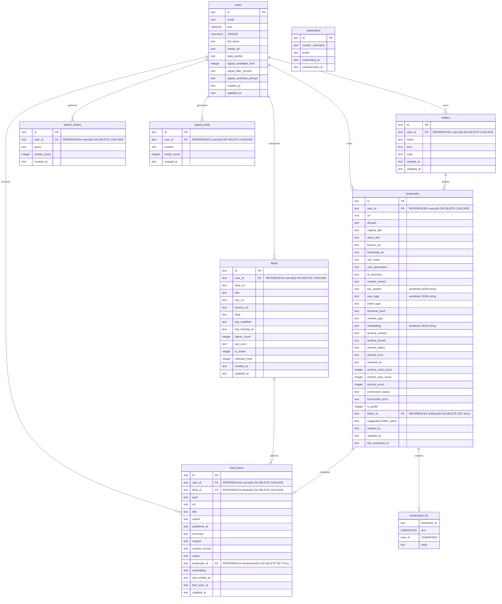
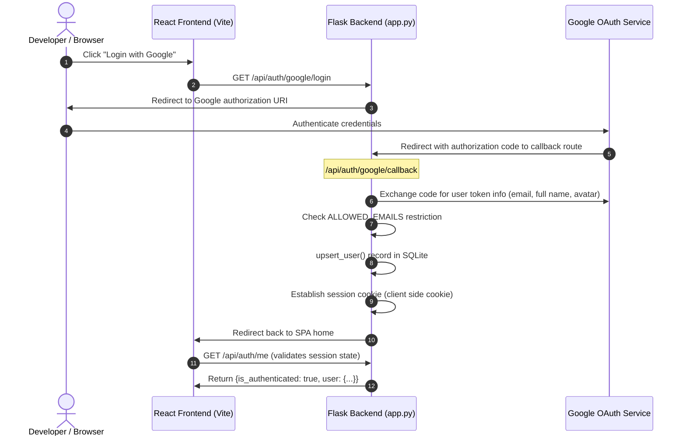
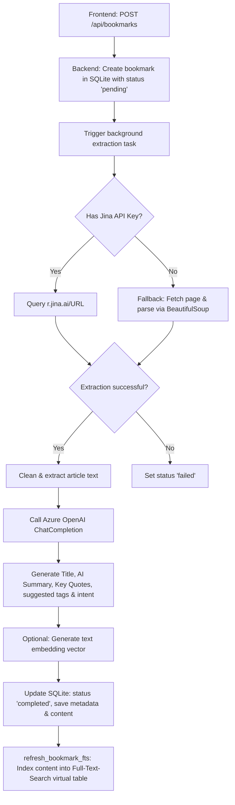
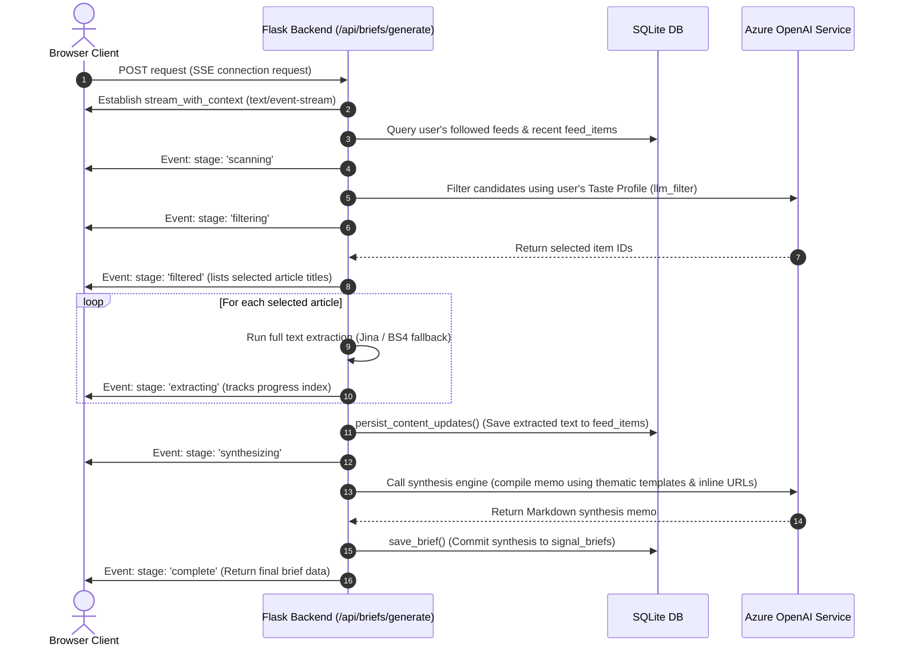

# Markly Architecture & Data Flow Guide

This document maps the database models, integration pipelines, and authentication flows of `markly` to provide a mental model of the system for developers and AI agents.

---

## 🗄️ Database Entity-Relationship Map
The SQLite schema is initialized procedurally in [database.py](file:///Users/sarathavasarala/Desktop/Projects/markly/backend/database.py#L81-L230). Below is a mapping of tables, constraints, and relationships:

---

## 🔑 Authentication Flow (Google OAuth)
Authentication utilizes Google OAuth with cookie sessions managed by the Flask backend.

---

## ⚡ Bookmark Enrichment & Archiving Pipeline
Saving bookmarks starts an asynchronous background workflow that parses content and generates AI metadata.

---

## 📊 SSE Daily Brief Synthesis Flow (Signal)
The Signal briefing compiles high-signal feed items into a unified daily memo using Server-Sent Events (SSE).

